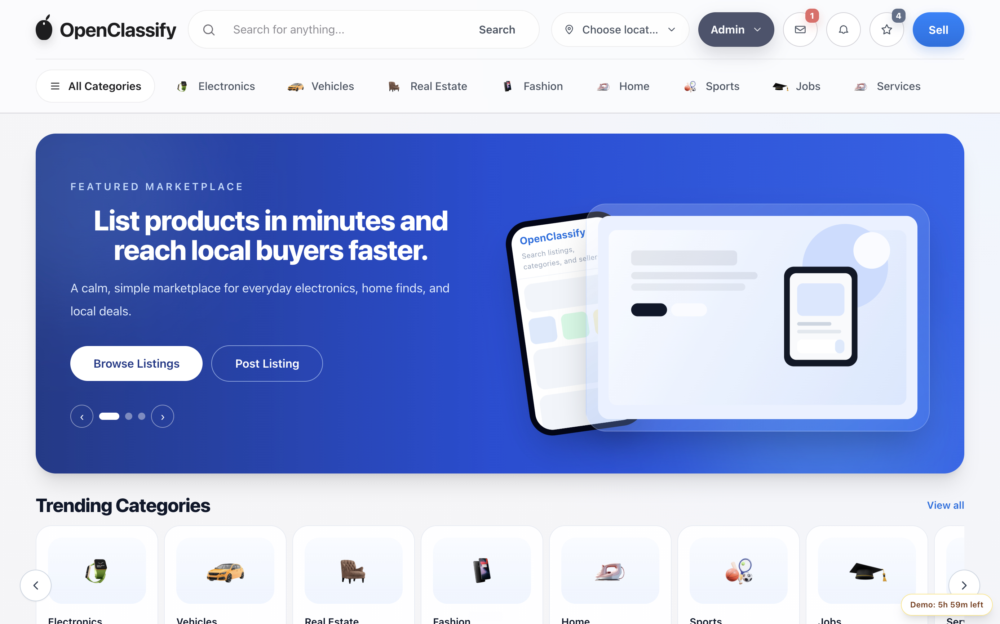

# OpenClassify

OpenClassify is a modular classifieds marketplace built with Laravel 13 and Filament v5.



## Core Stack

- PHP 8.4+
- Laravel 13
- PostgreSQL 16+
- FilamentPHP v5
- `nwidart/laravel-modules`
- Blade + hand-authored CSS design system + Vite
- TypeScript (strict) for all browser behaviour
- Spatie Permission
- Laravel Reverb + Echo (realtime chat)

## Architecture

Modular monolith. Every business capability lives in `Modules/*` with its own routes,
models, migrations, seeders, translations and views. Modules never JOIN across each
other's tables; cross-module reads go through the composition-root helpers in
`app/Support/*Directory.php`.

Conventions enforced across the codebase:

- `declare(strict_types=1);` in every PHP file
- No comments — names and types carry the meaning
- SoftDeletes on every domain table
- Fat models own all database access; controllers stay thin
- English identifiers, with per-module `lang/{locale}/messages.php` translations

### Modules

| Module | Responsibility |
|--------|----------------|
| `Site` | Layout, home, settings, locale switching |
| `Listing` | Listings, custom fields, browse and detail |
| `Category` | Category tree |
| `Location` | Countries, cities, districts |
| `User` | Auth, profiles, public seller storefronts |
| `Panel` | Subscriber dashboard and listing wizard |
| `Conversation` | Buyer/seller inbox with realtime messages |
| `Favorite` | Saved listings, sellers and searches |
| `Offer` | Price offers and negotiation |
| `Review` | Seller ratings and reviews |
| `Report` | Abuse reports and moderation queue |
| `Notification` | In-app notification feed |
| `Promotion` | Featured/urgent promotion plans and orders |
| `Page` | CMS pages, sitemap.xml, robots.txt |
| `Video` | Listing video upload and transcoding |
| `Admin` | Filament admin panel wiring |
| `Theme` | View theme resolution |
| `Demo` | Per-visitor demo schemas |

Create a new module:

```bash
php artisan module:make ModuleName
```

Enable it in `modules_statuses.json`.

## Frontend

The browser layer is strict TypeScript compiled by Vite. There is no runtime
framework and no animation.

```
resources/ts/core/       DOM, HTTP, storage and behaviour-registry primitives
resources/ts/modules/    One file per behaviour, mounted from data-* attributes
resources/ts/realtime/   Echo subscription for the inbox
resources/css/base/      Design tokens, reset, typography, layout
resources/css/components/ Component styles (button, card, header, panel, ...)
```

Behaviour is bound declaratively: a module declares a selector, the registry mounts
it once per element. No inline scripts in Blade.

```bash
npm run type-check   # tsc --noEmit, strict + noUncheckedIndexedAccess
npm run lint         # eslint, type-checked rules
npm run build        # type-check then vite build
```

Breakpoints: base (phone), 40rem, 48rem (tablet), 64rem (desktop), 80rem (wide).

## Quick Start

### Docker

```bash
cp .env.example .env
docker compose up -d
```

App URLs:

- Frontend: `http://localhost:8000`
- Admin: `http://localhost:8000/admin`
- Panel: `http://localhost:8000/panel`

### Local

Requirements: PHP 8.4+, Composer, Node 20+, PostgreSQL 16+.

Create the databases first:

```bash
createdb openclassify
createdb openclassify_testing
```

```bash
composer install
npm install
cp .env.example .env
php artisan key:generate
php artisan migrate
php artisan db:seed
composer run dev
```

`db:seed` populates every module with realistic sample data: locations, a category
tree, 120 listings with images, videos, conversations, favourites, offers, reviews,
reports, notifications, promotion plans and orders, and CMS pages.

## Seeded Accounts

| Role | Email | Password |
|------|-------|----------|
| Admin | `a@a.com` | `236330` |
| Member | `b@b.com` | `36330` |

## Demo Mode

Demo mode provisions a temporary, per-visitor marketplace schema.

Requirements:

- `DB_CONNECTION=pgsql`
- `DEMO=1`

Minimal `.env`:

```env
DEMO=1
DEMO_TTL_MINUTES=360
DEMO_SCHEMA_PREFIX=demo_
DEMO_COOKIE_NAME=oc2_demo
DEMO_LOGIN_EMAIL=a@a.com
DEMO_PUBLIC_SCHEMA=public
```

Commands:

```bash
php artisan demo:prepare
php artisan demo:cleanup
```

Notes:

- First guest homepage shows only `Prepare Demo`.
- `Prepare Demo` creates/reuses a private schema and logs in seeded admin.
- Expired demos are cleaned up automatically (hourly schedule).

## Realtime Chat (Reverb)

Set `.env`:

```env
BROADCAST_CONNECTION=reverb
REVERB_APP_ID=app_id
REVERB_APP_KEY=app_key
REVERB_APP_SECRET=app_secret
REVERB_HOST=localhost
REVERB_PORT=8080
REVERB_SCHEME=http
REVERB_SERVER_HOST=0.0.0.0
REVERB_SERVER_PORT=8080
VITE_REVERB_APP_KEY="${REVERB_APP_KEY}"
VITE_REVERB_HOST="${REVERB_HOST}"
VITE_REVERB_PORT="${REVERB_PORT}"
VITE_REVERB_SCHEME="${REVERB_SCHEME}"
```

Start:

```bash
composer run dev
```

Channel strategy:

- private channel: `users.{id}.inbox`
- events: `InboxMessageCreated`, `ConversationReadUpdated`

## Test and Build

```bash
php artisan test
npm run type-check
npm run lint
npm run build
vendor/bin/pint
```

The test suite runs against the `openclassify_testing` PostgreSQL database. Prepare
it once with:

```bash
APP_ENV=testing DB_DATABASE=openclassify_testing php artisan migrate:fresh --seed --force
```

## Production Checklist

```bash
php artisan migrate --force
php artisan db:seed --force
php artisan storage:link
php artisan config:cache
php artisan route:cache
php artisan view:cache
```

## Contributors

- Website: [openclassify.com](https://openclassify.com)
- Package: [openclassify/openclassify](https://packagist.org/packages/openclassify/openclassify)
- Contributors: [GitHub graph](https://github.com/openclassify/openclassify/graphs/contributors)
